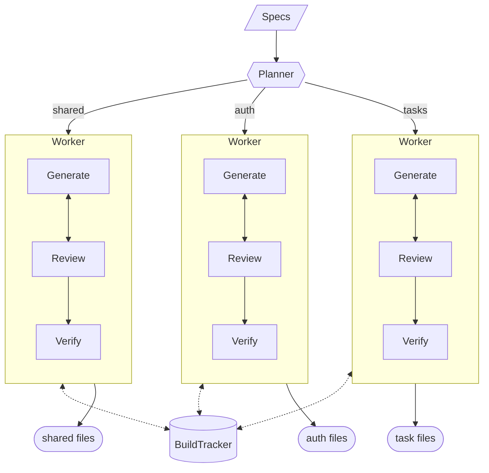

# clawspec


Nobody reads compiled assembly. Nobody opens `.o` files to check if the compiler did a good job. You trust the toolchain and work at a higher level.

What if we treated source code the same way?

Right now AI coding tools help you write and edit code faster. Clawspec asks a different question: what if you stopped looking at the implementation entirely? You describe your program entirely with markdown files — entities, rules, user stories, acceptance criteria — and the generated code is a build artifact. You don't read it, you don't edit it, you don't review it, you need no knowledge of how the code works. When the spec changes, the code is regenerated.

This bets on models improving to the point where they can reliably produce working software end-to-end from a spec. We're not there yet, but we might be soon! This is a proof of concept exploring what the tooling looks like if that bet pays off.

```
my-project/
├── PROJECT.md          ← you maintain this (tech stack, shared entities)
├── specs/
│   ├── auth.md         ← you maintain this
│   └── tasks.md        ← you maintain this
└── src/                ← generated, never touched
    ├── package.json
    ├── lib/firebase.ts
    ├── app/login/page.tsx
    └── ...
```

The specs are your source code. The model is your compiler. What we currently call "source code" is just the build output -- generated code that's not manually edited or reviewed.

The north star: if you know Bazel, imagine a build rule like `clawspec(project = "PROJECT.md", features = ["specs/auth.md", ...])` that produces an entire working application.

## Agent architecture

The generation is structured like a software team.

A **planner** reads all the specs and breaks the project into milestones — independent workstreams like "shared infrastructure", "auth", "tasks" — while modeling the dependencies between them. Each milestone is assigned to a **worker**, which breaks it down into individual file tasks, tracks progress, and uses Claude Code to generate each file. All agents coordinate through a shared **BuildTracker** — essentially a bug tracker that every agent reads and writes to, so workers can see what other milestones have produced and block on dependencies.



The planner declares dependency edges between milestones — auth and tasks both depend on shared infrastructure. Workers block until their dependencies are marked complete in the tracker. Within a milestone, files are generated sequentially so each can reference the ones before it.

For a project with auth and tasks features, the execution looks like:

```
Phase 1: "shared" (no deps)       Phase 2: "auth" + "tasks" (parallel)       Phase 3: "docs"
├── package.json                   ├── [auth] lib/auth.ts    │ [tasks] lib/tasks.ts
├── tsconfig.json                  ├── [auth] app/login.tsx  │ [tasks] app/tasks.tsx
└── lib/firebase.ts                └── [auth] middleware.ts   │ [tasks] TaskList.tsx    └── README.md
```

The coordination pattern — planner plans, workers execute in parallel, shared artifacts instead of sequential context passing — is the part I think generalizes. This is the simplest version.

## What's missing (and what comes next)

This is a proof of concept. The generation works, but "never look at the code" is a vision, not a guarantee — yet. The pieces that would actually close the gap:

**Verification loop.** The most important missing piece. After generation, agents check the output against acceptance criteria, run type checking, resolve imports, and feed failures back for regeneration. This is what turns "generate and hope" into "generate and prove." Without it, you're trusting the model. With it, you're trusting the test suite — which is the same thing you do with human-written code.

**Standups.** After each workstream phase, a manager agent reviews what was produced, catches integration issues across workstreams, and replans remaining work. A standup that takes seconds instead of the next morning.

**Spec refinement.** Before planning, an agent reads your specs, asks clarifying questions, flags ambiguities. The spec sharpens iteratively before any code is written. The quality of the output is bounded by the quality of the spec — this is the tool that raises that ceiling.

**Build system integration.** The real version of this is a Bazel/Buck rule where spec files are inputs and generated source is an output you never check in.

## Spec format

`PROJECT.md` — project-level context:
```markdown
# Task Manager

## Tech Stack
- Next.js with TypeScript
- Firebase Auth and Firestore

## Entities
### User
A person who uses the app. Has a name, email (unique), and password.
```

`specs/auth.md` — one feature per file:
```markdown
# Authentication

## Entities
A **User** has a name, email, and password. Email addresses must be unique.

## Rules
- Passwords are never stored in plain text
- Login sessions expire after 24 hours

## Constraints
- Use Firebase Auth for all authentication
- Store user profile data in a Firestore `users` collection

## User Stories
### Sign Up
A new user provides their name, email, and password...

**Acceptance criteria:**
- Submitting with valid data creates a Firebase Auth user and Firestore doc
- Submitting with an existing email shows "Email already in use"
- After successful signup, the browser is on `/tasks`
```

Everything is plain language. `Constraints` are optional — omit them and the planner makes the technical calls. Include them to pin specific decisions. Acceptance criteria are the contract: the generated code must satisfy every one.

## Usage

```bash
pip install -e .

clawspec init myproject       # scaffold PROJECT.md + specs/
clawspec check myproject      # validate spec completeness
clawspec build --dry-run myproject  # see the plan
clawspec build myproject      # generate into a git branch
clawspec build --sequential myproject  # skip parallel workstreams
```

Requires the [Claude Agent SDK](https://docs.anthropic.com/en/docs/claude-code/sdk) and an Anthropic API key.

## Project structure

```
src/clawspec/
├── cli.py              # Click CLI
├── parser.py           # Markdown spec → dataclasses
├── checker.py          # Spec validation
├── planner.py          # BuildPlan, Workstream, FileTask
├── tracker.py          # Cross-workstream shared state
├── generator.py        # Sequential + parallel orchestration
├── git.py              # Branch/commit
└── backends/
    ├── __init__.py     # AgentBackend protocol
    └── claude_agent.py # Claude implementation + prompts
```
